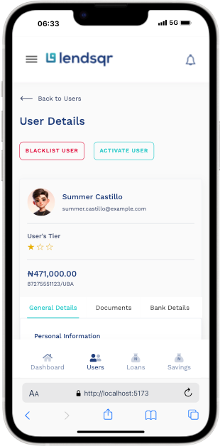

# Lendsqr Admin


## Description

Lendsqr Admin is a comprehensive administrative dashboard built with Vue.js 3 for managing the Lendsqr lending platform. It provides interfaces for handling users, loans, savings, guarantors, reports, and various other financial and administrative tasks.

## Features

- **Authentication**: Secure admin login system with email and password authentication, token management, and protected routes.

<div align="center">
<table>
<tr>
<td align="center">
<strong>Desktop</strong><br/>

</td>
<td align="center">
<strong>Mobile</strong><br/>

</td>
</tr>
</table>
</div>

- **Dashboard**: Interactive dashboard with statistics cards, overview metrics, and quick access to key administrative functions.

<div align="center">
<table>
<tr>
<td align="center">
<strong>Desktop</strong><br/>

</td>
<td align="center">
<strong>Mobile</strong><br/>

</td>
</tr>
</table>
</div>

- **User Management**: View, search, and manage user details, including profiles, loans, and status.

<div align="center">
<table>
<tr>
<td align="center">
<strong>Desktop</strong><br/>

</td>
<td align="center">
<strong>Mobile</strong><br/>

</td>
</tr>
</table>
</div>

- **Filter Functionality**: Advanced search and filtering options in data tables, user lists, and other modules for efficient data handling.

<div align="center">
<table>
<tr>
<td align="center">
<strong>Tablet</strong><br/>

</td>
<td align="center">
<strong>Mobile</strong><br/>

</td>
</tr>
</table>
</div>

- **Loan Handling**: Manage loan requests, products, decisions, and settlements.
- **Savings and Fees**: Oversee savings products, fees, charges, and pricing.
- **Reports and Audits**: Generate reports, view audit logs, and track system messages.
- **Preferences and Settings**: Configure system preferences, service accounts, and organization details.
- **Additional Tools**: Karma tracking, whitelists, and transaction monitoring.

## Tech Stack

- **Framework**: Vue.js 3
- **Build Tool**: Vite
- **State Management**: Pinia
- **Routing**: Vue Router
- **UI Components**: Bootstrap Vue Next, Reka UI
- **Styling**: SCSS with custom variables and mixins
- **Testing**: Vitest
- **Linting**: ESLint with Prettier
- **TypeScript**: For type-safe development

## Prerequisites

- Node.js (version 22 or higher recommended, based on tsconfig)
- Yarn package manager

## Installation

1. Clone the repository (replace with your actual repo URL if applicable):

   ```sh
   git clone https://github.com/demola33/Lendsqr-admin.git
   cd lendsqr-admin
   ```

2. Install dependencies:

   ```sh
   yarn install
   ```

3. Copy the example environment file and configure as needed:

   ```sh
   cp example.env .env
   ```

## Usage

### Development Server

Start the development server with hot reloading:

```sh
yarn dev
```

Open [http://localhost:5173](http://localhost:5173) in your browser.

### Build for Production

Compile and minify for production:

```sh
yarn build
```

### Run Tests

Execute unit tests:

```sh
yarn test:unit
```

### Lint and Format

Lint the codebase:

```sh
yarn lint
```

Format the code:

```sh
yarn format
```

### Generate Icons

Run the icon generation script:

```sh
yarn generate-icons
```

## Project Structure

- `src/components/`: Reusable Vue components
- `src/views/`: Page views for different modules (e.g., users, loans)
- `src/services/`: API services and mock data
- `src/stores/`: Pinia stores for state management
- `src/router/`: Vue Router configuration
- `public/`: Static assets like images and fonts

## Contributing

Contributions are welcome! Please follow these steps:

1. Fork the repository
2. Create a new branch (`git checkout -b feature/YourFeature`)
3. Commit your changes (`git commit -m 'Add YourFeature'`)
4. Push to the branch (`git push origin feature/YourFeature`)
5. Open a Pull Request

## License

This project is licensed under the MIT License - see the [LICENSE](LICENSE) file for details.
